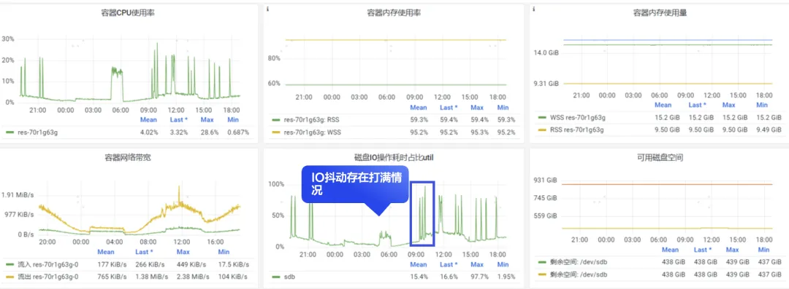

# Using DBdoctor for database inspection: smoothly coping with the Spring Festival traffic peak

## 01.Why burn incense and worship Buddha when the database has been inspected?
Database inspection is a preventive maintenance measure that is generally automated using scripts or tools. The inspection objects involved include hardware and system resources, binlog, parameter configuration, database performance, security, backup and recovery, etc. It is a very complex and detailed job. Any small problem may become a risk point for database instability. Especially for database performance issues, it is a difficult problem for the entire database industry. Although DBA's daily operation and maintenance experience based on rules, indicators, etc. can handle most basic inspections, what should DBA do if there are performance problems during inspections? Should they handle them or not? How to troubleshoot without on-site investigation after locating the problem? These torn moments make people hate and fear database inspections, and sometimes feel helpless and can only "bow down".

For example, the following problem scenarios that our company has encountered:

### 1）Database SQL resource consumption is difficult to quantify, and performance jitter is difficult to find the root cause of SQL
During the inspection process, we counted the usage of database instance CPU and disk IO for a week, and found that many instances had performance jitter issues, making it difficult to quantify which SQL was causing it. This made the inspection colleagues hesitant, not knowing whether to handle or not to handle this result. If handled, it would be difficult to troubleshoot without on-site data, and the benefits may be minimal. If not handled, there is a concern of becoming a potential explosive point at any time.

### 2）The database itself provides incomplete root cause results, making it impossible to see what the real results look like in the database kernel

For example, in the deadlock log, the Hold lock information of the first transaction in the MySQL kernel in versions 5.6 and 5.7 is not printed. The log displays only the currently executed SQL and cannot display all the SQL of the transaction. Therefore, it is difficult to accurately obtain the complete formation process of this deadlock loop. Even if the deadlock log is given to the business side, it is difficult to completely solve the problem.

For example, regarding the issue of business card, analyzing lock waiting based on system tables in MySQL cannot directly obtain the detailed SQL blocking relationship between transactions. It is necessary to analyze audit logs with transaction information to accurately analyze. Currently, most audit logs in the industry are captured through network packet capture, and transaction-related information is missing, making accurate correlation impossible.
### 3）Strong dependency experience makes index optimization difficult to evaluate
Currently, index recommendation relies heavily on the experience of DBAs and requires case-by-case analysis. Some database vendors with research and development capabilities have implemented rule-based index recommendation capabilities, but it is not accurate in many scenarios and index optimization is difficult.

From the above issues, it can be seen that performance issues are like a sword of Damocles hanging over every DBA's head, relying entirely on luck. This is why some internet companies seek database stability by burning incense and worshiping Buddha. Despite this, DBAs still have to carry their computers and be on standby 24 hours a day during holidays, relying on luck to decide whether they can play happily today. So, is there a solution? Let's invite DBdoctor!

## 02.Database performance diagnostic tool DBdoctor's inspection capability
Unlike traditional inspections, in addition to supporting basic monitoring, one-click inspections, and inspection reports, the 3.1.1 version of DBdoctor adds deep inspections for performance issues, conducts in-depth analysis and obtains inspection results, provides on-site restoration and accurate root cause SQL for finding anomalies, and provides optimization suggestions. This enables DBAs to achieve fast inspections and timely closed-loop solutions to performance issues.

### 1）Inspection depth drill down based on eBPF technology to accurately identify the root cause of abnormal problems
1. Performance CPU, IO and other resource issues can be quantified to quickly evaluate the root cause of abnormal jitter in resource indicators. By including resource jitter as a inspection item in the inspection, the health status of the instance can be further evaluated, and the root cause SQL can be accurately prompted for the problem found in the inspection.

2. MySQL kernel-level Data Acquisition based on eBPF technology allows you to peek into the complete execution process of each SQL statement, provide fine-grained index data, and achieve on-site playback of exceptions, without relying on guesswork or similar fault reviews to draw true conclusions.
3. Make up for the incomplete root cause of the deadlock in the MySQL kernel itself. DBdoctor can completely and accurately restore the deadlock formation process without invading the user database source code, and can obtain the full deadlock log of the user without opening the deadlock print parameter. There is no need to wait.

4. Full record of business card problems, visualized swimlane diagram playback of the lock waiting transaction SQL formation process of the database kernel, can accurately answer the true root cause of a SQL slowdown. For example, SQL kernel lock, physical resource bottleneck, SQL itself cost consumption, etc.

### 2）Self-developed Cost-based InnoDB optimizer, providing the best optimization suggestions for SQL problems
Unlike the rule-based experience approach, our self-developed bypass Cost optimizer can quickly evaluate the actual Cost consumption of a SQL statement. Users can obtain the actual Cost cost of the SQL statement without enabling Optimizer Trace on the production database. In the index recommendation section, the Cost optimizer can evaluate the Cost cost consumption of selecting a new index for this SQL statement without adding an index to the user's production database, thus recommending the optimal index. At the same time, we quantify the cost of the recommended index, allowing users to quickly know how much the Cost cost consumption of the recommended index is reduced compared to the source table. It can also directly answer the question of R & D colleagues - how much performance improvement can be brought by adding this index.

## 03.How to use DBdoctor to inspect databases

DBdoctor inspection is divided into two modes: timed inspection and one-click inspection. Users can quickly know what problems exist in the database instance under the tenant project and view detailed inspection reports. For performance exception items in the inspection report, the performance insight function can be used to restore the abnormal moment scene, helping users quickly find the root cause of the exception and the best optimization suggestions. You can follow the steps below for inspection:

### 1）Find all the problems

#### step1. Select the tenant project, open Dashbord, drag it to the bottom, and there will be inspection-related cards

Note:
**①  Database Health Inspection Score**：Only display instances with inspection scores less than 100 points, display them according to the severity of the score from low to high, and view the inspection report of the instance. At the same time, users can choose to actively issue an immediate inspection. When it is found that there is no instance in the card of the database monitoring inspection score, congratulations, all instances under this tenant project are healthy.

**② Inspection report list**：Display the instance inspection summary report of the current tenant project dimension, and you can also click to expand the detailed inspection report of a single instance.

#### step2. View the inspection report for detailed examples

**The detailed inspection report of the example is mainly divided into the following parts:**
**① Inspection score**：score the health status of the instance, the score is 100 points full marks, indicating health
**② Problem summary**：Summarize the total number of problems inspected by this instance, and count the number of problems according to the risk level, such as the number of serious problems and warning problems.
**③ Inspection items**：The inspection report involves each inspection item, and specific analysis can be carried out for each inspection item, and the inspection results and repair suggestions can be obtained.
### 2）Solve fatal problems
Parameter configuration issues, resource issues, security issues, backup issues, and other common issues are relatively easy to solve through manual or scripting methods. DBdoctor's inspection report also includes repair suggestions for common issues. However, performance issues are a tricky sword hanging over DBAs, requiring a lot of time to track and analyze. How to thoroughly solve them?

#### step1. Open the Dashboard
You can directly list the instances with performance issues under the current tenant project for performance issues, and provide detailed statistics on the number of performance issues and the root cause SQL of the instance.

#### step2. Click on the instance name to jump to the root cause analysis page
Root cause analysis can summarize which types of SQL in this instance have performance issues (without flipping through slow logs or audit logs). At the same time, there will be detailed historical execution records for each type of SQL, which can replay the complete execution process of the entire transaction SQL. If there are performance issues with the SQL, DBdoctor will actively identify and provide optimal repair suggestions based on the COST optimizer, such as recommending indexes.

DBdoctor can replay the entire locking process and quickly restore the scene through transaction swimlane diagrams. DBAs can easily find the formation process of the lock through legend display and send it to relevant business R & D colleagues for early optimization before traffic peaks such as big promotions and holidays.

### 3）Conclusion

Deploying DBdoctor can not only smoothly cope with the peak traffic of big promotions, but also eliminate the torment of alarms at night, on weekends, and during holidays. It reduces cross-team fault shirking and truly achieves happy work and serious life!
