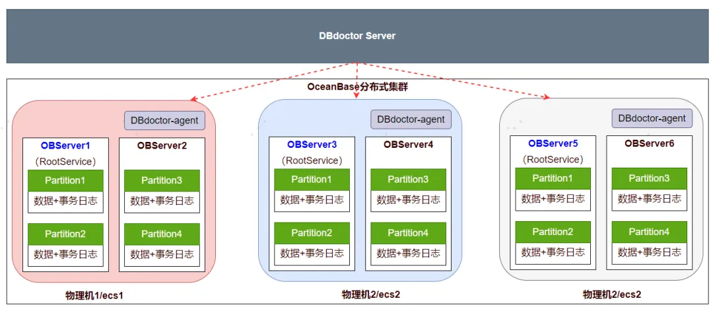
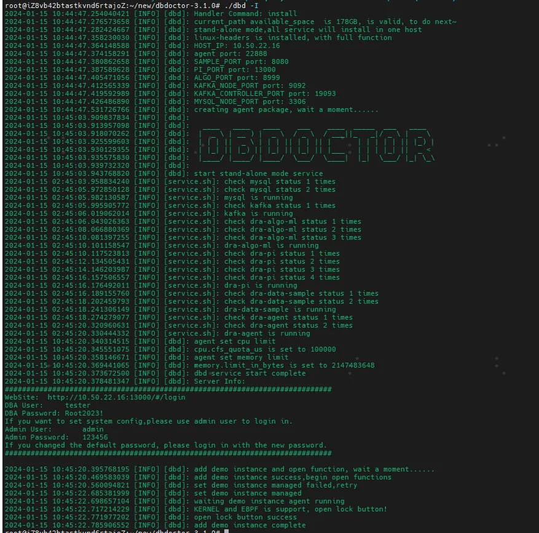
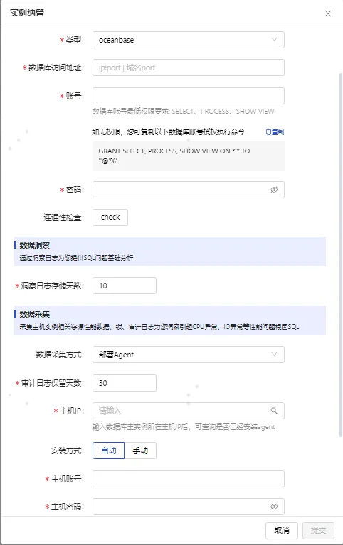
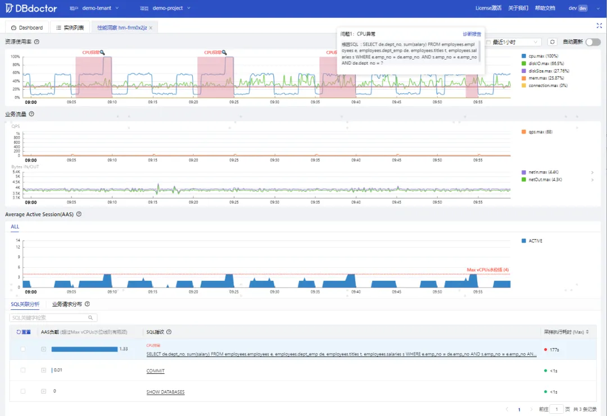

# DBdoctor Quick Narrow Tube OceanBase

## OceanBase architecture



DBdoctor only needs to find an ecs server for one-click installation and deployment, and then the whole process of web interface operation can complete the storage of OceanBase instances. Agents are deployed in the host dimension, and a host only needs to deploy one agent to complete the index collection of all database nodes on the host.

1. OceanBase is managed according to the OBServer node. Here we need to manage OBserver1, OBserver2, OBserver3, OBserver4, OBserver5, and OBserver6 respectively.

2. OceanBase nodes can be expanded in a distributed manner. If new nodes are added, they need to be managed according to the above method.

### 1）1 minute zero dependency DBdoctor Server installation

**Environmental requirements**：4c8g (independent resource deployment recommended)
**Download the installation package**：https://www.hisensecloud.com/h-col-126.html

```Bash
#Unzip the installation package and execute a command to complete the deployment
./dbd -I
```


**Service access address**：http:// host IP where the service is deployed:13000
**Login account**：tester/Root2023!
**Detailed documentation**：https://www.hisensecloud.com/h-col-144.html

### 2）Fast Transit OceanBase

#### a）First create a database account on OceanBase and grant permissions
```Bash
create user zx identified by 'Root2023!';
GRANT SELECT, PROCESS, SHOW VIEW ON *.* TO 'zx'@'%';
```
#### b）OceanBase instance management on the DBdoctor instance list page

-  Click the "Instance Nanotube" button to enter the database access address, account password and other basic information of the instance, and then click the connectivity detection prompt Sucess to indicate that the verification is correct.

- By default, the agent method is used for Data Acquisition, and the host account information is entered. It supports automatic and manual agent installation.



**Remarks**：Agent system support description: support X86_64 and ARM system, do not support x86_32 server. Both connectivity tests have passed, congratulations on your successful instance management, you can start the performance diagnosis.

### 3）How to use the performance insights feature
#### a） Enable performance analysis

Find the OceanBase node that has been taken in the instance list, and click the Performance Insights switch button to start the analysis.

#### b）View performance insights
Click Performance Insights to gain insight into OceanBase's node performance.



The performance insight function can correlate multi-dimensional index performance data such as hard resources and databases through the timeline and analyze them. For example, the above CPU abnormal Case we only need 1 step to find the root cause of the problem SQL , and can restore the detailed scene of the abnormal time interval.

- **Automatic root cause recognition**：CPU resource indicators jitter, automatically box the abnormal interval and prompt the root cause SQL.

- **Detailed site restoration**：

    - CPU abnormal time interval box selection

    - Abnormal time interval In the AAS module, we can see that the number of active sessions of the database exceeds the Max vCPU water level line in this time interval, indicating that there is a performance bottleneck

    - The event where performance bottlenecks can be seen is ACTIVE (i.e. blue color event), and this color accounts for the largest area in the AAS trend chart.

    - Based on the event with the largest color in this area, we can find the green-colored SQL as the first one, that is, the root cause SQL that caused the CPU to skyrocket. Click to expand this SQL to show the worst sample of this SQL, click Execution Plan Discovery to scan the full table to scan the rows, and add an index to the SQL.


