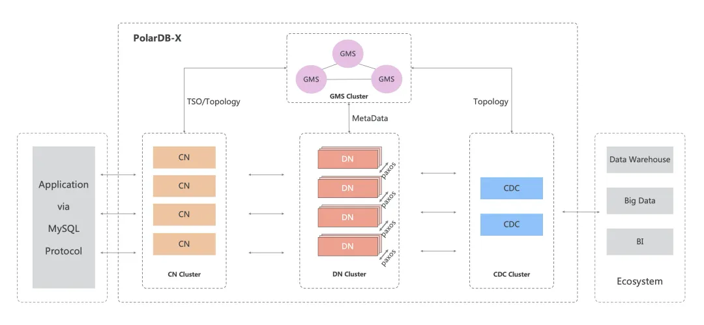
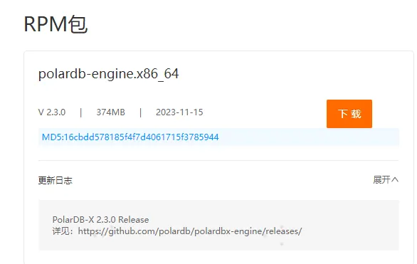
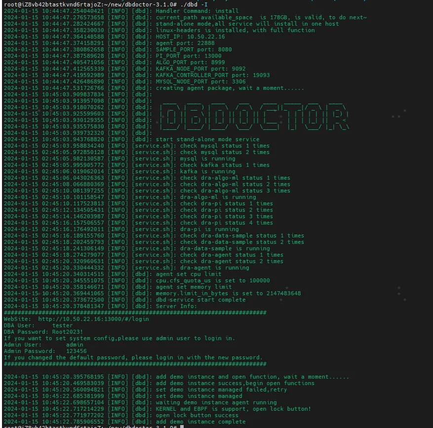
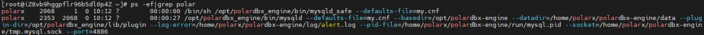
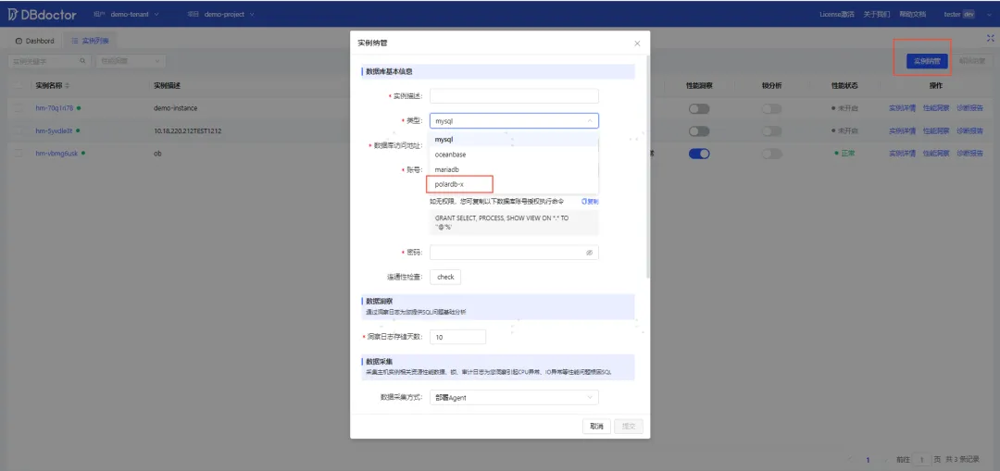
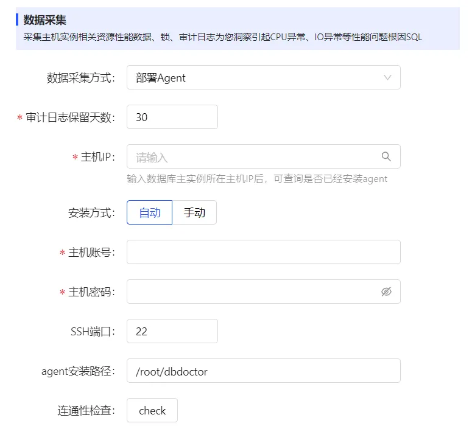
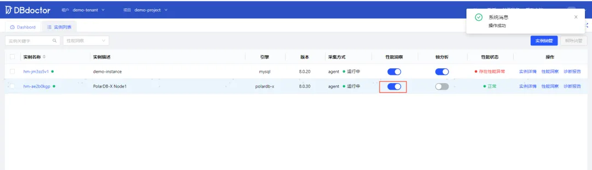
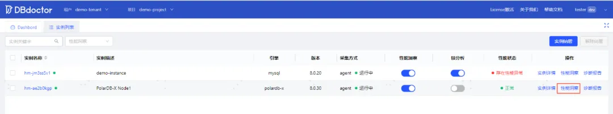
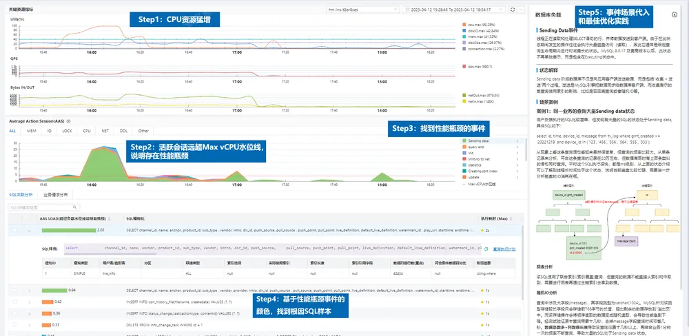

# Performance diagnostic tool DBdoctor How to quickly manage database PolarDB-X

Recently, DBdoctor (V3.1.0) officially passed the product integration certification test of Alibaba Cloud Ali Cloud Aliyun PolarDB distributed version (V2.3), and obtained the product ecological integration certification issued by Alibaba Cloud Ali Cloud Aliyun.


This article will introduce the features of PolarDB and how to quickly manage the database PolarDB-X.

## 01. PolarDB-X (Centralized Form) Product Architecture
PolarDB-X is a high-performance Cloud Native distributed database product independently designed by Alibaba. It adopts a Shared-nothing and storage separation computing architecture, supports centralized and distributed integrated forms, and has the capabilities of high availability of financial-grade data, distributed horizontal expansion, mixed load, low-cost storage, and extreme elasticity. It provides users with high-throughput, large storage, low latency, easy scalability, and ultra-high-availability cloud era database services.

In October 2023, PolarDB-X open source officially released version V2.3.0, focusing on the centralized form standard version, which provides separate services for DN nodes (the deposit is not separated). In the performance scenario, using production-level deployment and parameters (enabling double 1 + Paxos multi-copy strong synchronization), compared with the open source MySQL 8.0.34, PolarDB-X has a 30-40% performance improvement in read-write mixed scenarios, which can be used as the best alternative to open source MySQL.

##### PolarDB-X architecture diagram



##### PolarDB-X is designed with a separate architecture of Shared-nothing and storage computing. The system is composed of four core components:

- Compute Nodes（CN, Compute Node）

The compute node is the entry point of the system and adopts a stateless design, including SQL parser, optimizer, executor and other modules. It is responsible for data distributed routing, calculation and dynamic scheduling, Byte Transaction 2PC coordination, global secondary index maintenance, etc. At the same time, it provides enterprise-level features such as limited viewership of SQL and separation of powers.

- Storage Nodes（DN, Data Node）

The storage node is responsible for the persistence of data, providing high reliability and strong consistency based on the majority Paxos protocol, and maintaining Byte Transaction visibility through MVCC.

- metadata services（GMS, Global Meta Service）

The metadata service is responsible for maintaining the globally consistent Table/Schema, Statistics and other system Meta information, maintaining the security information such as accounts and permissions, and providing global timing services (ie TSO).

-  Log Node（CDC, Change Data Capture）

The log node provides incremental subscription capabilities that are fully compatible with the MySQL Binlog format and protocol, and leader/follower replication capabilities that are compatible with the MySQL Replication protocol.
##### How PolarDB-X works with three copies of MySQL based on Paxos:

- At the same time, there will be at most one leader node in the entire cluster to undertake the task of data writing, and the remaining nodes will participate in majority voting and data synchronization as followers


- Paxos' protocol log Consensus Log fully integrates the original binlog content of MySQL. Consensus-related binlog events will be added to the binlog protocol on the Leader master node, and the traditional Relay Log will be replaced on the Follower standby node. The standby library will Replay the log content to the data file through SQL Thread, which can be simply understood. Paxos Consensus Log Technologies MySQL Binlog


- Based on the Paxos majority automatic master selection mechanism, the heartbeat/election timeout mechanism will monitor the changes of the Leader node. When the Leader node is unavailable, the Follower node will automatically complete the master cutting. Before the new Leader node provides services, it needs to wait for the SQL Thread to complete the Replay of the stock log to ensure that the new Leader has the latest data.

##### PolarDB-X technical features

- High performance, using a single leader mode, which can provide performance similar to the MySQL semi-sync mode

- RPO = 0, Paxos protocol log fully integrates the original binlog content of MySQL, and ensures that data is not lost based on the majority synchronization mechanism

- Automatic HA, based on Paxos' election heartbeat mechanism, automatically completes node exploration and HA switching.

## 02. DBdoctor Nanotube PolarDB-X

### 1）Prepare a centralized version of PolarDB-X

If it is only used for test verification, PolarDB-X can be installed manually, and the installation and deployment can be carried out as follows

#### a）download
Download address：

https://openpolardb.com/download




#### b）PolarDB-X database installation and login
##### 1. Dependent package installation
```Bash
rpm -ivh t-polardbx-engine-2.3.0-b959577.el7.x86_64.rpm
yum install libaio*
```
##### 2.Create and switch to polarx user
```Bash
useradd -ms /bin/bash polarx
echo "polarx:polarx" | chpasswd
echo "polarx ALL=(ALL) NOPASSWD: ALL" >> /etc/sudoerssu - polarx# 创建必要目录mkdir polardbx-enginecd polardbx-engine && mkdir log mysql run data tmp
```
##### 3. Create my.cnf configuration file
```Bash
[mysqld]
basedir = /opt/polardbx-engine
log_error_verbosity = 2
default_authentication_plugin = mysql_native_password
gtid_mode = ON
enforce_gtid_consistency = ON
log_bin = mysql-binlog
binlog_format = row
binlog_row_image = FULL
master_info_repository = TABLE
relay_log_info_repository = TABLE

# change me if needed
datadir = /home/polarx/polardbx-engine/data
tmpdir = /home/polarx/polardbx-engine/tmp
socket = /home/polarx/polardbx-engine/tmp.mysql.sock
log_error = /home/polarx/polardbx-engine/log/alert.log
port = 4886
cluster_id = 1234
cluster_info = 127.0.0.1:14886@1

[mysqld_safe]
pid_file = /home/polarx/polardbx-engine/run/mysql.pid
```
##### 4. Initialization
```Bash
/opt/polardbx_engine/bin/mysqld --defaults-file=my.cnf --initialize-insecure
```
##### 5. Start
```Bash
/opt/polardbx_engine/bin/mysqld_safe --defaults-file=my.cnf &
```
##### 6. Login to the database

```Bash
mysql -h127.0.0.1 -P4886 -uroot
```

### 2）One-click installation and deployment of DBdoctor

Environmental requirements: 4c8g

Download installation package:
https://www.hisensecloud.com/col.jsp?id=126

Unzip the installation package and execute
```Bash
./dbd -I
```



After successful installation, log in to http://< host ip of deployment service >: 13000

Login account：tester/Root2023!

Detailed installation and usage documentation:=：
https://www.hisensecloud.com/h-col-144.html

### 3）DBDoctor Nantube PolarDB-X

At the level of the deployed PolarDB-X process, we can see that it is almost identical to the MySQL cluster, and DBdoctor can manage it completely in the way of MySQL. DBdoctor's PolarDB-X management is managed according to the DN node dimension of the cluster (DN is equivalent to mysqld at the process level), and the above three nodes are equivalent to managing each node in turn.



#### a）First, create a database account on PolarDB-X and grant permissions
```Bash
create user zx identified by 'Root2023!';
GRANT SELECT, PROCESS, SHOW VIEW ON *.* TO 'zx'@'%';
```
#### b）Centralized PolarDB-X management on DBdoctor's instance list page

Switch to the tab of the instance list, click the instance management button, and enter the instance.

##### ①  enter the basic information of the Master Data database of the instance and perform connectivity testing:
Click the "Instance Management" button to enter the existing database instances of the user.

- Configurable database basic information for this instance, including instance notes and database access addresses

- Can set the account information of the database instance, including the account and password of the instance



##### ② Configuration Data Insights
> Set the number of days for Insight log storage (default is 10 days)
##### ③ Select Collection Method
Deploy Agent for PolarDB-X Data Acquisition mode to collect performance data from hosts and instances. Lock and audit logs are not currently supported in the current version. Adaptation support for this engine will be considered in the future.



## 03. How to use DBdoctor for performance diagnosis of PolarDB-X

### 1）Enable performance analysis

Check the instance list to find the management database node of PolarDB-X. Click the performance analysis switch of the instance node to take over the performance insight function of the instance. The lock analysis function of PolarDB-X is not yet available (audit logs and diagnosis of the four major lock scenarios), and this function can only be supported after the subsequent version GA.



### 2）View performance insights
Click the Performance Insights button to perform a performance analysis of this instance.



Click to view the performance insights analysis results of the instance.



#### The detailed features of Performance Insights are mainly divided into the following 7 parts:

**1. Instance search**：Users can choose the instance that has been taken over for performance insight function display, the instance specifies the time interval or the fast time selection search of nearly 5m, 1h, 5h, 24h, 2d, and can specify the refresh rate.

**2. Key resources**：Display the usage of key resources of the instance to evaluate whether there is a resource bottleneck, and display the trend graph of key resource usage indicators of the DB dimension/host dimension of the instance, including CPU usage, MEM usage, IOPS usage, DISK Space usage, and connection usage. At the same time, display the maximum value of each indicator in the current time interval.

**3. Business traffic**：Display the traffic indicators of the business, including the incoming and outgoing traffic of network packets and the QPS situation of the business at the database level.

**4. AAS**：Show the database load through the average active session of the business database, and show the TOP waiting events in the load.

**5. Associated SQL**： Show the root cause SQL associated with the AAS load, and you can also view the worst sample of the SQL and perform execution plan display.

**6. Business load traffic distribution**：display the AAS load according to the user/source service IP dimension, and evaluate which business system the source of the database load problem comes from.

**7. Expert experience database**：Show in detail the expert experience document of the performance problem event, explain how the event is generated in principle, and how to optimize it.
#### Performance Insight Practice：

The biggest feature of Performance Insight is the ability to correlate performance data from all dimensions through a timeline for analysis. For example, in the CPU exception case mentioned above, we only need 4 steps to find the root cause of the problem in SQL.

Step 1 : CPU resource indicators jitter occurs at 15:45~ 16:20, and the CPU is full.

Step 2 : In the AAS module, we can see that the number of active sessions in the database far exceeds the Max vCPU waterline in this time interval, indicating that there is a performance bottleneck.

Step 3 : The event where you can see the performance bottleneck is Sending data (i.e. green color event), and this color occupies the largest area in the AAS trend chart. Clicking on the event can also see the expert experience document on the far right.

Step 4 : Based on the event with the largest color in this area, we can find the green SQL as the first one, which is the root cause of the CPU surge. Click to expand this SQL to show the worst sample of this SQL, click to execute the plan to find the full table scan more than 40,000 rows, and add an index to the SQL.