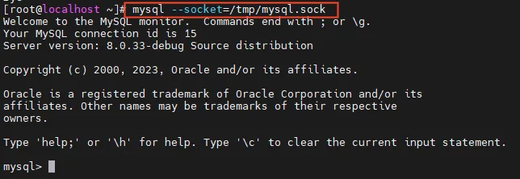

# eBPF Topic 1 | Step-by-step guide to diagnose MySQL with eBPF (including source code)

## Background
eBPF, known as the "revolutionary" kernel technology, has always been highly regarded. As a database performance diagnostic tool, DBdoctor has deeply applied eBPF technology to the database field for the first time. Currently, it covers many functions such as SQL performance auditing, problem SQL one-minute positioning, lock analysis, audit logs, root cause diagnosis, index recommendation, and intelligent inspection. Many friends are interested in how to use eBPF technology to observe the database kernel. Therefore, we have opened an eBPF technology column on the [DBdoctor] official account, which will regularly share eBPF-related technical articles with you and teach you how to use eBPF to detect databases. Welcome to follow us!

This article is the first installment of the eBPF topic. It will use a specific example to introduce how to use eBPF to add probes to MySQL connection validation and type hello world. Come and experience the power of eBPF together!
## Overview of eBPF

eBPF (Extended Berkeley Packet Filter) is a technology that executable code in the Linux kernel, allowing developers to run specific functions without modifying the kernel code. Traditional BPF can only be used for network filtering, while eBPF is more powerful and flexible, with more application scenarios, including network monitoring, security filtering, and performance analysis. Uprobe is a usage of eBPF, which allows us to insert code in user-space applications to monitor and analyze function calls in the kernel.
Specifically, eBPF uprobe can select a target function in a user-space application and insert custom code logic before and after the function execution. This can achieve functions such as monitoring, performance analysis, and error detection of the target function. With eBPF uprobe, we can dynamically track and analyze functions in the kernel without modifying the kernel source code.

## 01. Working principle


Uprobe is a type of user probe that allows dynamic instrumentation in user programs. The instrumentation locations include: function entry, specific offset, and function return. When we define uprobe, the kernel creates a fast breakpoint instruction on the attached instruction. When the program executes the instruction, the kernel triggers an event, the program enters Kernel Mode, and calls the probe function as a callback function. After executing the probe function, it returns to User Mode to continue executing subsequent instructions.

Uprobe is based on files. When a function in a binary file is tracked, all processes that use this file will be instrumented, so that system calls can be tracked throughout the system. Uprobe is suitable for parsing traffic that cannot be parsed by Kernel Mode probes in User Mode, such as HTTP2 traffic (packet headers are encoded and cannot be decoded by the kernel), HTTPS traffic (encrypted traffic, which the kernel cannot decrypt), etc.

## 02. How to detect MySQL with eBPF uprobe?
### 1）Environment preparation
> Prepare a Linux machine and install Python and kernel development package. (Note: The kernel development package version must be consistent with the kernel version)
Install MySQL with symbol tables.

### 2）Implement MySQL detection based on BCC tool


The BCC program is written in Python and embeds a piece of C code. During execution, the C code is compiled into BPF bytecode and loaded into the kernel for execution. Python code can copy data from the kernel to user space through perf events, read the data, and then display it.

Next, we will write an eBPF program based on BCC's uprobe to observe whether there are a large number of short connections on MySQL.

#### a）Analyze MySQL source code related connection processing functions
```C
//从MySQL源码中分析函数选用了mysql-server层的连接校验处理函数check_connection
static int check_connection(THD *thd){
  ...
}
```
#### b）Import BPF objects from BCC
```python
#!/usr/bin/python
//Analyze the function from the MySQL source code and use the connection verification processing function of the mysql-server layer check_connection
from bcc import BPF
```
#### c）Write observation code in C
```Python

bpf_text="""
#include <uapi/linux/ptrace.h>
#include <linux/sched.h>

//Define the structure data_t save the result of each observation
struct data_t {
    u32 pid;
    u32 tgid;
    u64 ts;
    char info[40];
};

//PF_PERF_OUTPUT 定义了一个叫 events 的表，观测代码可以将观测数据写入到 events 表中
BPF_PERF_OUTPUT(events);

//This custom function is used to bind and associate with the kernel function observed by MySQL
int do_check_connection(struct pt_regs *ctx) {
    //Obtained the structure task_struct corresponding to the MySQL process, and then obtained the thread pid and user space process tgid from it
    struct task_struct *t = (struct task_struct *)bpf_get_current_task();
    
    //Initialize data to save observation results
    struct data_t data = {};
    
    // create a new connection
    char a[] = "hello world,create a new connection";
    bpf_probe_read_kernel_str(&data.info,sizeof(data.info),a);
    
    // process id
    bpf_probe_read(&data.pid,sizeof(data.pid),&t->pid);
    
    // thread id
    bpf_probe_read(&data.tgid,sizeof(data.pid),&t->tgid);
    
    // bpf_ktime_get_ns returns u64 number of nanoseconds. Starts at system boot time but stops during suspend.
    data.ts = bpf_ktime_get_ns();
    
    //Submit the observed data to the table
    events.perf_submit(ctx, &data, sizeof(data));

    return 0;
}"""
```
#### d） Observe the code to associate the functions that need to be observed in MySQL
```Python
# initialize BPF
//custom ebpf program
b = BPF(text=bpf_text)
//Bind the custom function in the ebpf observation code to the kernel function of MySQL (name is the mysqld process path, sym is the name of the compiled probe function, fn_name the bound ebpf custom function)
b.attach_uprobe(name="/home/mysqld", sym="_ZL16check_connectionP3THD",fn_name='do_check_connection')
```
#### e） Print observations
```Python

# output trace result.
print("Starting to Trace MySQL server do_check_connection function")
print("------------------------------------------------------------")

//Define the callback function for printing
def print_event(cpu, data, size):
    event = b["events"].event(data)
    decoded_string = event.info.decode('utf-8')
    print("%-35s, process id %-6s, thread id %-6s, sytem uptime(s) %-14s" % (decoded_string,event.tgid, event.pid,event.ts/1000000000))

//open_perf_buffer register the printed callback function in the events table
b["events"].open_perf_buffer(print_event)
while 1:
    try:
        b.perf_buffer_poll()
    except KeyboardInterrupt:
        exit()
```
#### f） effect demonstration
Execute the eBPF program


Open two windows to execute the command to connect to MySQL



Print the results of observations


From the above demonstration, we can see that when the Client and MySQL establish a connection, a log will be printed, displaying the verification time, thread id, and process id of the connection. If there is a large amount of log output, it indicates that new connections (i.e. short connections) have been created on the database, and then the next step is to analyze which application caused it.

## 03. What are the limitations of eBPF during program development?

There are many problems with eBPF during application and development. Here are some limitations that eBPF may encounter during program development:

#### 1） Stack size 512 bytes

The eBPF single probe function limits the stack size to 512 bytes, and using BPF_PERF_OUTPUT to output data from Kernel Mode to User Mode directly limits the size definition of a single data structure to no more than 512 bytes.

#### 2）Multi-parameter acquisition

BCC macro definition from PT_REGS_PARM1 (x)~ PT_REGS_PARM5 (x), the stack pass parameters, from the right to the left of the stack, want to get the probe function imported parameters can be obtained by PT_REGS_PARM, but the number of X86 registers is limited, BCC definition is to get 5 parameters, for more than 6 parameters can not be directly obtained.

#### 3） loop traversal

Kernel kernel version lower than 4.15 does not support any loops.

#### 4）Analysis of complex data structures

For parsing complex data structures in parameters, since the eBPF program cannot directly refer to the Header File of User Mode, and cannot directly define C++ classes in the eBPF code, it cannot directly obtain its member variables for complex data structures.

Example:
```C

class THD: public MDL_context_owner,
           public Query_area,
           public Open_tables_state
 {
    public:
    MDL_context mdl_context;
    enum enum_mark_columns mark_used_columns;
    unlong wat_privilege;
    LEX *lex;
    bool gtid_executed_warning_issued;
    ...
    private:
    ...
    LEX_CSTRING m_catalog;
 }
 ```
This data structure is more complex, and when using eBPF to obtain the m_catalog of this data structure, it is obviously impossible to define the same data structure in the kernel for conversion.
 #### 5）uretprobe gets imported parameter values
When the uretprobe is triggered, the register can only ensure that the return value of rax is effectively retained, and the value of the function imported parameter cannot be directly obtained.

## Summary

Using eBPF technology to detect MySQL has the advantages of more efficient, more scalable, and more secure. You can observe the performance of the database without modifying the kernel. Through the above example, do you find that it is not difficult to use eBPF to track the database? The main threshold is to be proficient in the database kernel and Linux programming, and to have a sense of excellence in the code. Has your hello world appeared? Welcome to the group to discuss with us!