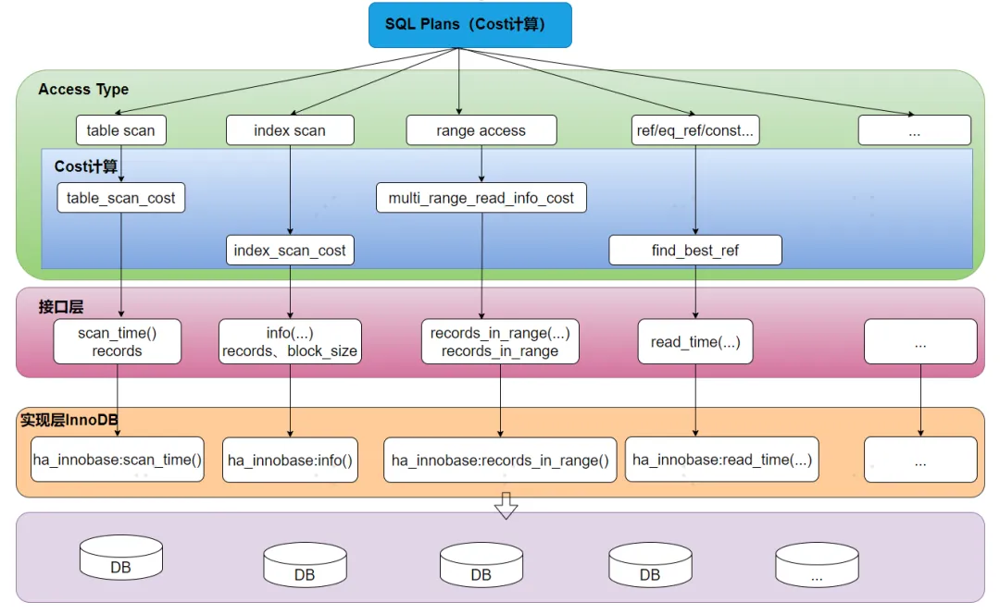

# The most powerful SQL audit tool in history

## The current state of SQL auditing in the industry

SQL audit refers to the detection of SQL that is not online, and identify whether it meets the specifications in advance to ensure the online quality. Yearning, Archery, Bytebase, goInception, SQLE are the current mainstream open-source SQL audit tools in China, all of which are based on rules for SQL audit , which can check the standardization, but cannot be based on the online data situation for SQL performance evaluation , so the SQL after the audit will still exist after the online performance risks .

## Can I do SQL performance auditing based on rules?

Every company has its own SQL specification standard, i.e. different rules. The more rules, the stricter the management. For example, the following common SQL audit rules:

- To create a table, you need to have an autoincrement primary key
- Prohibit the use of triggers
- Prohibit the use of stored procedures
- Prohibit the use of index sleeve functions
- The number of in (...) keyword elements used in the query condition should not exceed 5000

Through these rules, problems at the SQL syntax level can be identified in advance. You may have questions about whether the audit rules based on DBA experience are reliable? Taking the fifth rule as an example, limiting the rule to 5000 is itself problematic. In fact, it is still a comprehensive consideration of multiple factors such as table row record length, data volume, discrete layer, and IO page scan times involved in SQL, and should not be a specific experience value.

Can SQL rule auditing override performance auditing? We handwrite a rule to verify whether SQL has performance issues:
```SQL
#The SQL to be reviewed is as follows, pur_jit_item table has self-incrementing primary key id, isolation level RR, and no other indexes
update pur_jit_item set qualified_qty=5316 where fatory_code=7 and mat_sap_code=3
```


When there are few fields, we can see from the above figure that the fields not indexed that the SQL rule review hits have performance problems , but if there are too many fields, some fields have indexes, and the field discrimination is not good, how should the rules be written? Many experienced DBAs try to achieve performance identification by enumerating the rules of all scenarios. From the actual production point of view, there are too many factors to consider, and the same SQL results on different datasets may have N kinds, which cannot be accurately hit.

In summary, we conclude that it is not advisable to perform SQL performance audits in a traditional rule-of-thumb manner, and a low-cost and fast way is urgently needed.

## SQL performance review inspiration
Those who are familiar with the database kernel should know the optimal execution path of MySQL and PgSQL, evaluate it through Cost-based Optimization, and then select the optimal path. Let's take a look at the MySQL Cost Optimizer evaluation process.


##### 1）Establish evaluation criteria

MySQL system tables have built-in default cost calculation standards, which are divided into Server layer CPU cost and storage engine layer IO cost. For example, physical temporary tables disk_temptable_create_cost default one-time cost is 20. Through this detailed standard definition, the cost of SQL in each operation can be quantified, and specific Cost values can be obtained, which can provide data support for subsequent path selection.
##### 2）SQL optimal path selection

Session is started OPTIMIZER_TRACE, after the SQL is executed, the Trace log will record the detailed value of the cost consumption of each index path of the SQL, and finally select the path with the lowest cost consumption from all the paths as the best access path (hit index).

To sum up, the implementation of the bypass Cost optimizer requires solving two problems. First, it defines a set of cost evaluation criteria similar to MySQL, and then sorts out which statistics the Cost of each index path depends on and obtains.

## Database Cost Optimizer Source Code Interpretation

The final path selection of the database is calculated based on the Cost standard, and the external Cost calculation standard and formula can be bypassed to calculate the Cost consumption. Let's disassemble the kernel calculation process of the Cost optimizer from the MySQL Access Type dimension.



##### 1）Source Code Analysis Cost Calculation Formula
The calculation formula of Cost can be directly interpreted from the code. For example, taking Table scan full table scan as an example, the Cost of Table scan is divided into the sum of the two parts of IO Cost and CPU Cost. The approximate formula is:

```C
IO-Cost:#Pages_In_Table * IO_BLOCK_READ_COST + CPU-Cost:#Records * ROW_EVALUATE_COST
```
The IO-Cost is calculated by Table_Scan_Cost. There are two key variables Records and Pages_In_Table, which represent the number of row records and pages of the table respectively. In INNODB, the values of these two variables can be obtained by ha_innobase :: info_low (ha_innobase :: info) and ha_innobase :: scan_time (). Knowing the values of these two variables , you will know the specific Cost value .

##### 2）How to get the specific variable value in the Cost formula
For the variables in the formula , here take the existing index as an example , MySQL InnoDB estimates the statistical information of the index by analyzing the randomly sampled index leaf pages (sampling 20 pages, the statistical information can be obtained directly from the system table), estimates and selects the index path by sampling. If the bypass is implemented here, the variable value extraction can be carried out with full reference to the existing logic of MySQL.
##### 3）Cost calculation of this SQL for all paths
By calculating the cost of all paths, we can determine the path with the least cost consumption, which is the optimal path.

To sum up, we found that the external Cost optimizer is feasible. The external collection of the SQL table statistics, and then imitate the original MySQL analysis and evaluation behavior, can obtain the actual cost value of the SQL in the production environment. But there is a problem here, How to obtain statistical information for non-existent indexes?

## Principle of Bypass Cost Optimizer Based on eBPF

To achieve SQL performance evaluation of the production database, it is necessary to find all possible index execution paths of this SQL. Based on system tables It is relatively simple to obtain statistical information for existing indexes, but it is impossible to directly obtain statistical information for indexes that do not exist on the production database (to avoid high-risk heavy operations such as DDL directly on the source database) Therefore, it is necessary to extract statistical information from actual data online based on the SQL table. Here we can consider using eBPF technology to obtain key data indicators.

In the scenario of data skew, the range value of the where condition field of each SQL is different, and the true cost of index execution path selection will be different. Obtaining sampling pages is particularly important. The following describes in detail the process of SQL performance evaluation:


1. SQL Parse parses the condition fields and query fields of SQL tables.

2. Find all paths involved in reducing cost consumption. For the fields obtained in the first step, then permutate and combine them to establish A (n, m) candidate index paths .

3. Simulate the page sampling logic of MySQL, perform detailed page analysis and statistical information extraction, and restore the real sampling statistical information on the MySQL production library. For the data skew and other scenarios in the above case, it is possible to avoid the situation where the statistical information is inaccurate and the production execution path and the recommended path are inconsistent.

4. The greedy algorithm can calculate the cost of each candidate index, and the execution path of the current optimal index is the one with the smallest cost .

5. If the cost consumption of the optimal index is significantly different from that of the previous original path, it indicates that there is a performance problem with SQL.

In summary, whether there are performance issues with a single SQL can be engineered, but in actual production, we also need to pay attention to the global optimization of the table dimension , and need to build fewer indexes to meet the performance throughput of each business SQL and reduce the overhead caused by maintaining indexes.
## How to achieve global optimization in table dimensions?

The performance evaluation of a single SQL can be implemented in the above way, but in actual production, the maintenance of the index itself requires resources, so the more indexes are not the better. It is necessary to establish a globally optimal index. According to the experience of DBAs, two ways can be adopted for optimization: "de-redundancy" and "de-unused indexes". However, in practice, due to concerns about performance impact on business, people often dare not perform index operations and only do addition without subtraction. The following will elaborate on how to find the global optimal solution from the table dimension:


1. SQLParse parses the database & table and fields corresponding to SQL and recommends the best index.
2. Combining the full audit log analysis, the Statistical Data database instance involves all the fingerprint SQL of the table.
3. Analyze all fingerprint SQL and extract common high-frequency fields, fingerprint SQL-specific fields, etc. for classification.
4. Arrange and combine indexes according to field classification, calculate the cost of each fingerprint SQL and compare it with the original cost, and obtain multiple optimal paths without attenuating performance.
5. Based on the multiple optimal paths in the previous step, obtain the global cost optimal index path.
6. If the index has a large difference in cost consumption from the previous original path, it indicates that there is a performance problem with SQL.
7. The recommended index path is the best solution.

In summary, it is feasible to have a globally optimal index recommendation scheme based on an external Cost optimizer. Based on this scheme, SQL performance auditing can be achieved before the SQL is launched, and the globally optimal index recommendation based on the production data model can be evaluated.