# DBdoctor, dedicated to solving all performance issues of the database

Since its debut at the DTCC conference, DBdoctor has received extensive attention from colleagues in the industry. More than 200 users have applied our product to the production environment. At the same time, we have had in-depth exchanges with more than 20 industry companies including Oracle, Alibaba, Tencent, JD.com, ZTE, Mobile, Inspur, Woqu, and Acson. Combining everyone's suggestions, we have iterated five versions intensively, making significant leaps in both functionality and experience. Today, we have released version 3.1, which has basically achieved the first stage goal of "one-minute problem locating SQL".

## 01.What is DBdoctor?
DBdoctor is a kernel-level database performance diagnostic software dedicated to solving all performance problems of databases. Yes, we only focus on the extremely fine and specialized field of database performance. There is no shortage of platform-level products for databases in China, but we have not really solved the most painful point of performance. There are even fewer companies that focus solely on database performance. In the end, we chose to break through this most difficult mile for the industry.

DBdoctor: IT168 Best Innovative Product Award

The performance of performance issues is very digital and can be clearly reflected through basic monitoring. However, it is difficult to quantify the solution and relies heavily on fault handling experience. Therefore, industry products often rely on experience accumulation to solve problems, but still have not completely solved performance problems. DBdoctor has abandoned traditional empirical methods from the beginning and developed a unique mathematical quantification method. We internally compare DBdoctor to a CT machine for a database, which obtains real performance problems through CT scanning, rather than relying heavily on experience. DBdoctor can quickly diagnose performance problems, just like a CT machine can accurately locate the cause of the disease. Moreover, it can detect performance hazards in advance, just like the principle of preventing problems through CT during annual physical examinations. The difference is that DBdoctor will continuously guard your database in real time.

Database CT machine

Based on this, we hope to help more DBAs and R & D engineers. Help DBAs solve and avoid problems faster, completely release from oncall, and do more meaningful things such as architecture improvement; empower R & D personnel who are not familiar with databases to have the ability to troubleshoot database performance problems, and help enterprises without professional DBAs no longer be troubled by database performance problems.

The above picture is our logo, a cute woodpecker with the nickname "Bird Doctor". It has a sharp long beak and its body is composed of the abbreviation "DB" for database, implying that it will guard your database in real time like a woodpecker doctor and eliminate all bugs.

## 02. DBDoctor Origin
As an internet technology company under Hisense, Juhaokan serves hundreds of millions of internet TV users worldwide. Days when people gather to watch TV, such as the Spring Festival Gala, Olympics, and military parade, are our peak traffic. At the same time, as the cloud facility provider of Hisense Group, we manage tens of thousands of database instances.

As home appliances enter the era of intelligence and IoT, the importance of databases is self-evident. In 2020, I returned to the beautiful Qingdao from Alibaba Cloud Ali Cloud Aliyun RDS team and joined Jukaian to undertake the work of database de-O and cloudification. After a year, we successfully built our database private cloud platform and completed the de-O and cloud migration work. After de-O, we have been troubled by performance issues, which were previously covered up by Oracle and hardware. Therefore, we decided to write tools to solve these problems. Colleagues in the team have conducted in-depth research on eBPF and started using it. In 2021, the initial version V1.0 was implemented and landed in Jukaian's production environment.

In 2022, Ali friend Teacher Zheng joined the team as the R & D leader to comprehensively strengthen DBdoctor. At this time, not only within the group, but also multiple upstream and downstream cooperative enterprises actively proposed to use DBdoctor and gave high evaluations. This is V2.0.

At the beginning of 2023, based on the demands of the group and its partners, we conducted further research on the industry and database users. We found that performance issues have always ranked first among the top ten pain points of MySQL, and there are few products in the industry dedicated to solving database performance problems. Therefore, we monetized DBdoctor and finally released the V3.0 version at the DTCC conference. After five minor versions, DBdoctorV3.1 was released today.

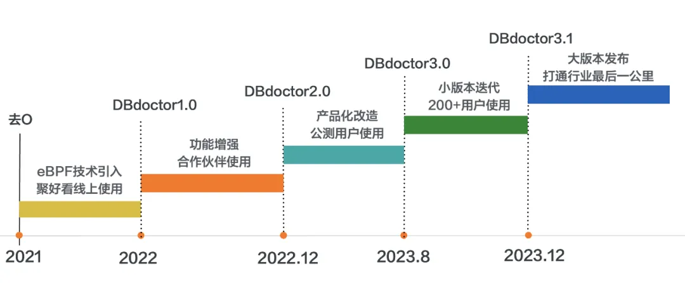

DBdoctor origin

## 03.DBdoctor design concept

### Challenges faced by performance issues
With the development of databases today, it is easy to build a database monitoring system based on Prometheus and Grafana. It monitors hundreds of indicators from hosts, containers to instances, and also collects slow logs, error logs, audit logs and other location issues. However, performance issues are still the biggest pain point, and there are three key phenomena.

1. **The matter is urgent**：at the critical moment of traffic surge such as big promotion, a problem with the database will affect tens of millions of users and income, and a failure can even lead to the bankruptcy of a small and micro enterprise, becoming the sword of Damocles hanging over the heads of relevant parties.

2. **Difficult to deal with**： usually there is no slow SQL, a problem is full of slow SQL, some SQL is not slow suddenly slow, monitoring indicators and logs float on the surface, it is difficult to locate the root cause, strong dependence on experienced senior DBA.

3. **Talents are difficult to cultivate**：Senior DBAs are difficult to recruit, and the experience of fault handling is difficult to inherit; in addition, the technical threshold of the database is high, and there are more than ten classifications of database locks alone, plus the diversification of the database engine now, senior DBAs are also difficult to cover everything, not to mention those companies that rely entirely on R & D engineers without full-time DBAs.

So in the past, when working at Alibaba Cloud Ali Cloud Aliyun, we often had to take turns on-call, busy fighting fires all day, and being woken up by phone alarms in the middle of the night was normal. Even after performance problems occurred, there would be phenomena of business parties and DBAs shirking responsibility and reviewing problems, which was unbearable.

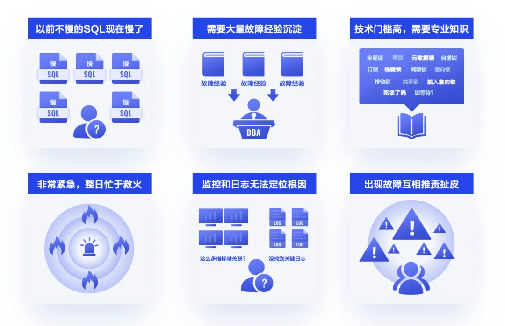

Challenges of performance issues

### The root cause of the above phenomenon
1. **Lack of more accurate indicator data**.Based on the slow log spit out by the database kernel, it is further processed into the analysis of execution time top or frequency, which is superficial. For example, the judgment of slow log is only based on execution time. Slow logs that exceed the time parameter threshold are all slow logs. It is difficult to distinguish which SQL is the real execution time long and which is blocked by other SQL. This is why it often appears that it was not slow before, but it became slow when it failed. Just like the example of a car and a tractor crossing the bridge in the figure below, because the tractor blocked the car crossing the bridge, the speed of the car was also very slow from the superficial data, but the real reason was that the tractor was slow or the bridge was too narrow.

2. **Lack of quantifiable data models**.  In the past, relying on experience accumulation, when encountering problems, we first look at whether we are familiar with them. Familiar ones can be quickly located, while newly introduced ones require a series of reproducibility verifications. Those that can be solved enter the experience database, and those that cannot become difficult problems to avoid. However, the speed of experience accumulation often cannot keep up with business development, so the experience of mature businesses is difficult to reuse in new businesses, and the experience that works on MySQL may not necessarily work on PostgreSQL. Experience ultimately comes down to rules. The industry is generally trying to enrich the rule database, but in the era of multi-engine coexistence, it is really difficult to build a universal rule database.
3. **Lack of measures to detect problems in advance**. The discovery of traditional performance problems is based on alarm-driven, lacking active discovery measures. By setting indicator thresholds, an alarm is issued when the monitoring indicator exceeds the threshold. Once the database instance reaches a certain scale, it is easy to appear two extreme cycles of relaxation and tightening. When there is no problem, alarm governance is carried out, and the threshold is increased to reduce the amount of alarm. After a problem occurs, the threshold is immediately lowered to improve sensitivity, treating the symptoms rather than the root cause.

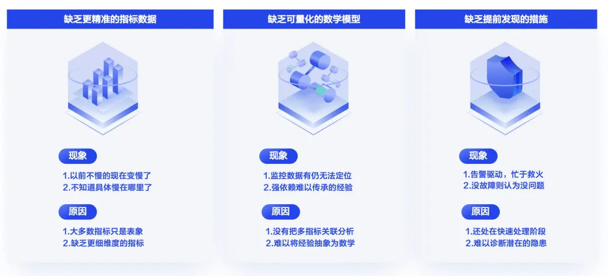

The root cause of the challenge

### What is the difference between DBDoctor?
DBdoctor has abandoned log collection and empirical rule methods since version 1.0, and firmly believes in solving mathematical problems through mathematical methods. eBPF is our main tool. Observing the execution path of SQL in the database kernel through eBPF and collecting the important consumption of each link is the technical breakthrough of DBdoctor1.0 version. Aggregating, analyzing, processing Big data based on these important data and associating it with basic resources such as CPU, IO, and MEM is the main challenge that DBdoctor2.0 has overcome. Identifying root causes and hidden dangers through mathematical models of graphic correlation analysis and abnormal image recognition is the main innovation of 3.0. Below, I will introduce these three advantages in detail one by one, which may be more technical, but absolutely novel.

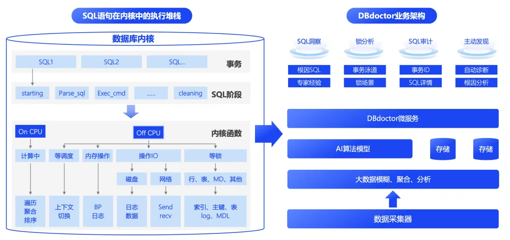

DBdoctor: overall architecture

### Advantage 1: Use more accurate indicator data for analysis
DBdoctor collected detailed resource consumption of an SQL statement on the execution stack based on eBPF technology, including CPU, IO, network, lock and other consumption data. Based on these consumption data, a specific distribution map of consumption was drawn according to the time dimension, and different colors were assigned. A series of graphics were placed in the same coordinate system, and detailed quantitative analysis was finally produced through compression and segmentation.
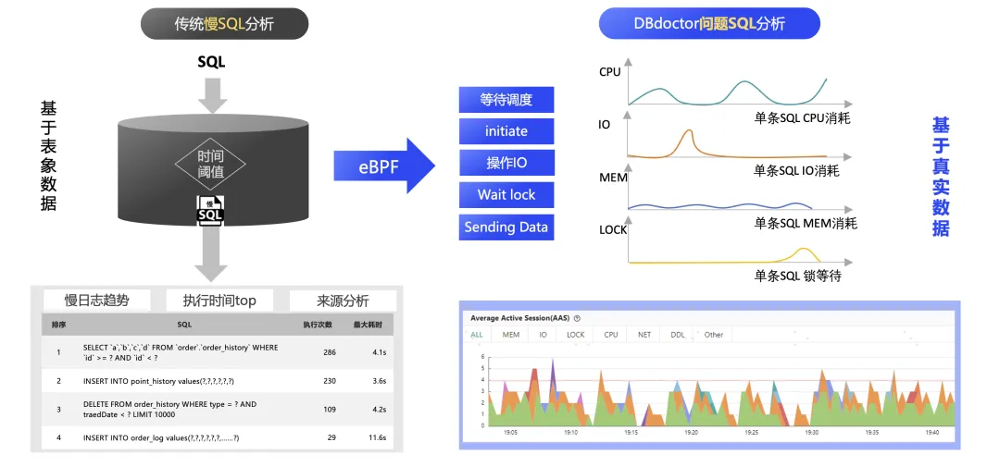

Use more accurate indicator data for analysis

Therefore, there is no need to link and scrutinize numerous and miscellaneous indicator items. Just focus on key resources and drag and drop to view specific diagnostic details. Use colors to distinguish different execution stages of SQL in the kernel, map resource consumption to color area, and calculate and filter by area and correlation algorithms (which will be explained in detail later) to obtain the main resource bottleneck. Support switching between different resource dimensions such as IO, lock, and CPU to view corresponding resource consumption.

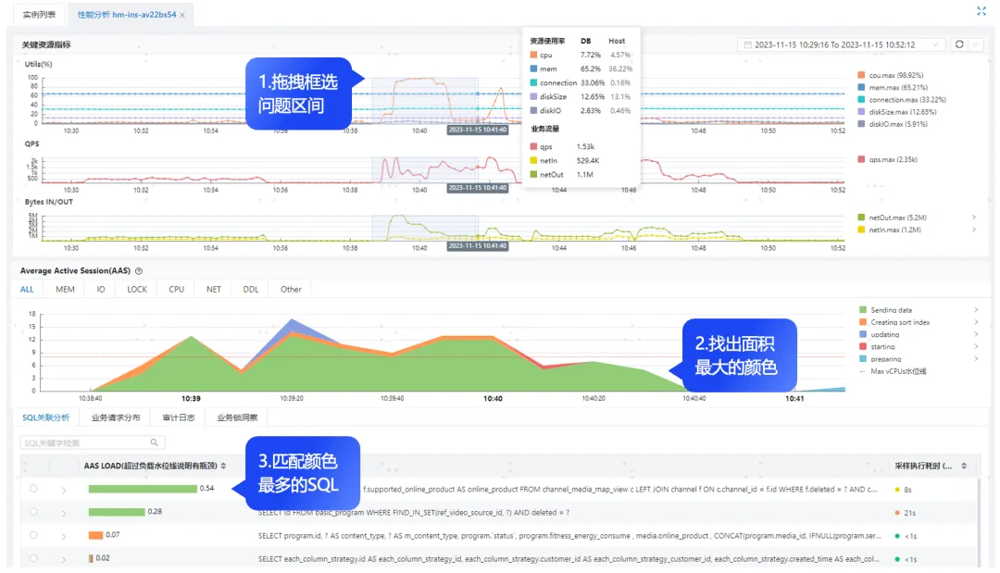

Three steps to accurately discover problems SQL

At the same time, fine grain data containing detailed lock data is collected, and this is concatenated in the Big data processing stage to form the following lock swimlane diagram. The lock problem is divided into four events: lock waiting, deadlock, long transaction, and uncommitted. This way, we can generate event portraits according to the characteristics of each event, such as the need for lock waiting and the need for a loop for deadlock. Lock events - > specific locks - > SQL where the locks are located - > transactions where SQL is located respectively - > SQL contained in the transaction - > locks contained in SQL, what type each lock is, the number of rows affected, whether it is held or waited, and its page and heap information. Moreover, we are currently breaking through the specific data of the lock, please stay tuned for details.

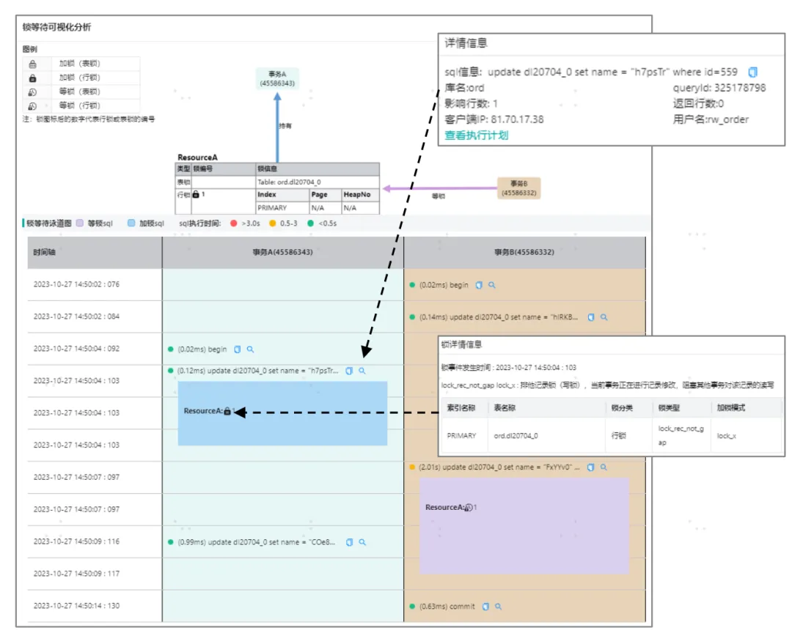

Lock wait visualization analysis

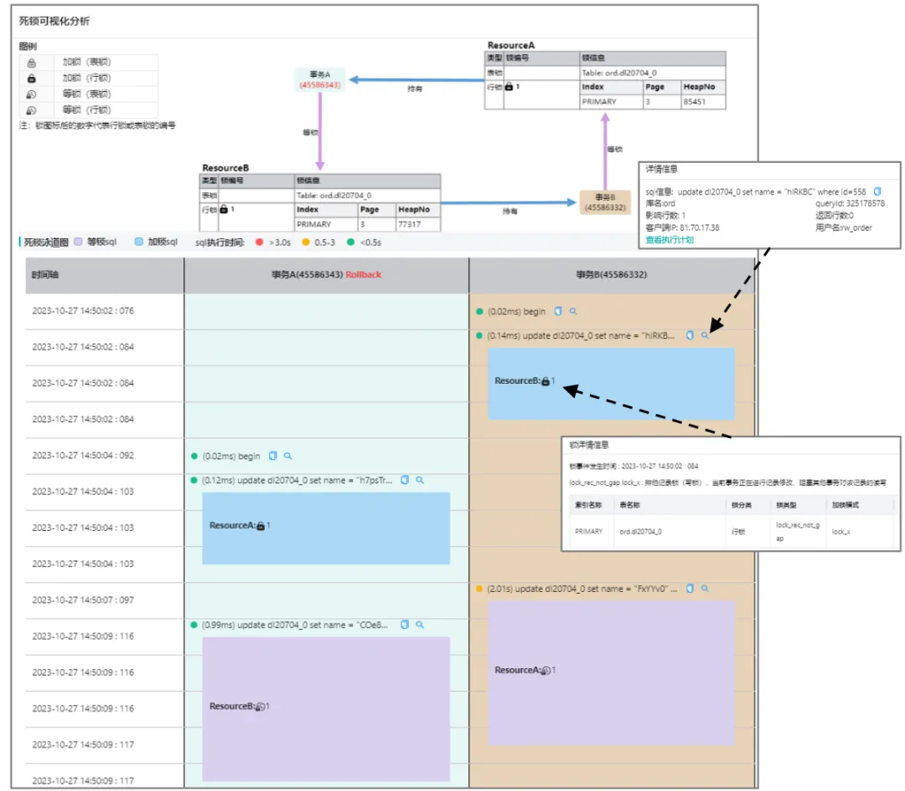

Deadlock visualization analysis

### Advantage 2: Use quantifiable mathematical models for analysis
DBdoctor first performs SQL fuzzy processing on the collected fine grain indicator data, aggregates the data according to the fuzzy SQL, and aligns the aggregated SQL again to the same Sequence Diagram. The resource consumption of each fuzzy SQL and the resource consumption of the entire instance are analyzed by correlation algorithm. Here, it can be simply understood as comparing the similarity of two graphs and giving the correlation score of the fuzzy SQL. The correlation score is reordered again to obtain the final ranking of the associated SQL. Therefore, the SQL in the DBdoctor SQL correlation analysis list is accurately calculated through mathematical models.

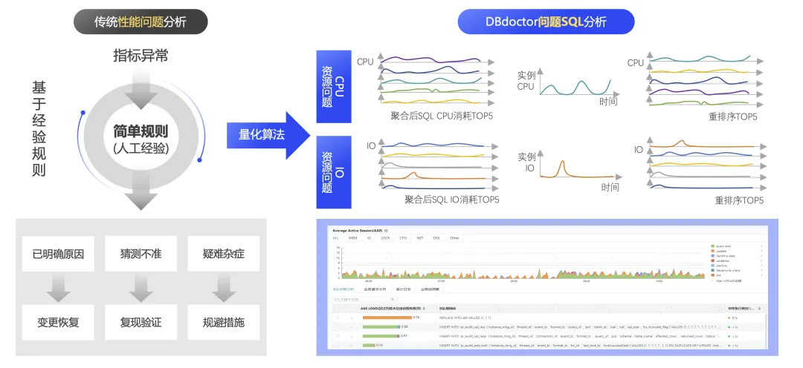

Analyze using quantifiable mathematical models

As shown in the figure below, you can view the detailed resource distribution of any SQL statement in DBdoctor, and view the consumption of specific resources such as CPU, IO, locks, and network. Multiple statements can be directly compared on the same coordinate axis, and can also be correlated with the resource consumption in the instance dimension.

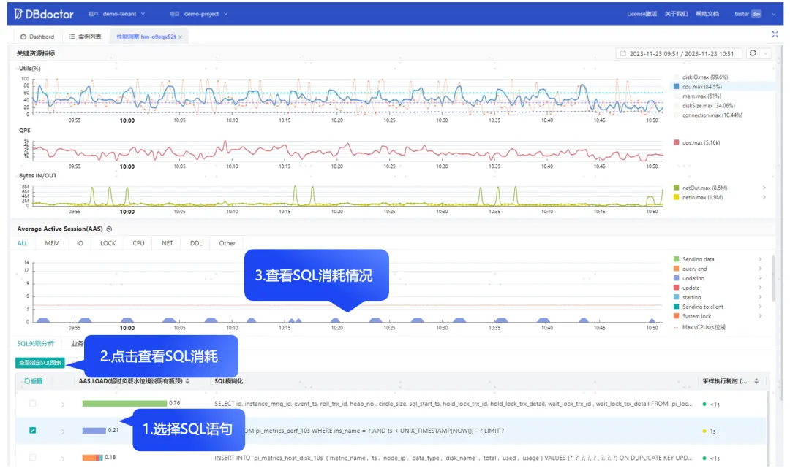

View specified SQL CPU consumption and correlation

As for the detailed state during the SQL execution process, it is a reflection of the finer grain of resource consumption. DBdoctor will provide a detailed explanation and provide some scenario cases and optimization suggestions.

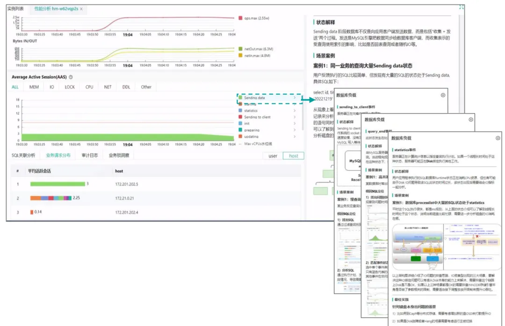

Give optimization suggestions

### Advantage 3: Proactively discover potential problems to avoid failures

Based on the above two points, we propose a problem discovery algorithm based on graphic recognition, which can be understood as searching for graphic mutations and classifying them according to different mutation amplitudes. Currently, it is mainly divided into two levels: anomaly and hidden danger, as shown in the yellow and red squares in the figure below. At the same time, we not only actively identify the event, but also locate the root cause of the event, especially in scenarios where multiple events occur in the same area. Here, we mainly implement a set of root cause correction algorithms, which will be weighted and corrected based on whether the SQL is newly added, whether the performance is deteriorating, whether it is related to other SQL, and whether it is already the source, etc., and finally obtain the root cause SQL.

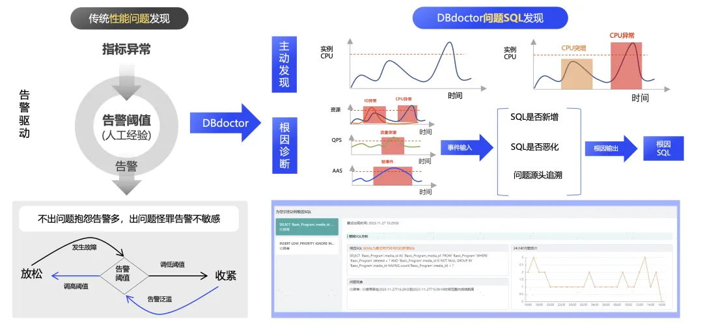

Proactively discover potential problems

As shown in the figure below, resource anomalies (CPU, IO, etc.), traffic anomalies (QPS), various lock anomalies, etc. can be distinguished in the anomaly and hidden danger intervals, and the root cause SQL that caused this anomaly or hidden danger is given. In addition, DBdoctor will also integrate various anomalies in near real-time for linkage analysis and weighted correction, obtain the root cause of the entire instance dimension, and provide problem phenomena and detailed analysis for the root cause. Further optimization suggestions will be given later to provide a complete root cause diagnosis report.

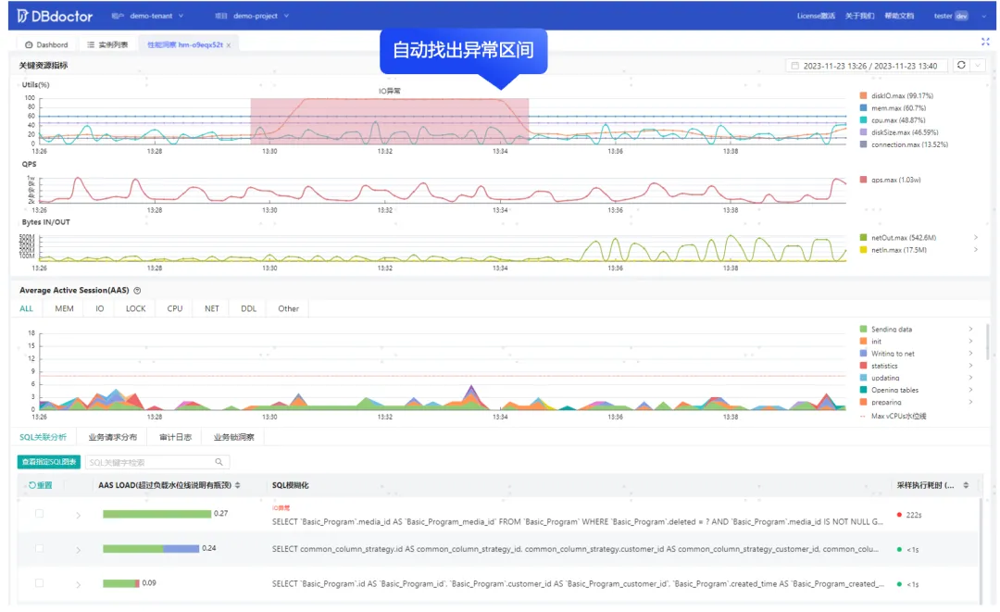

Automatically find abnormal intervals

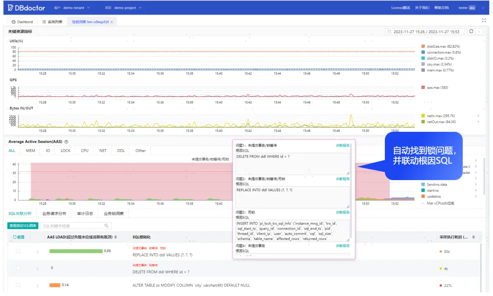

Automatically discover lock issues and find the root cause

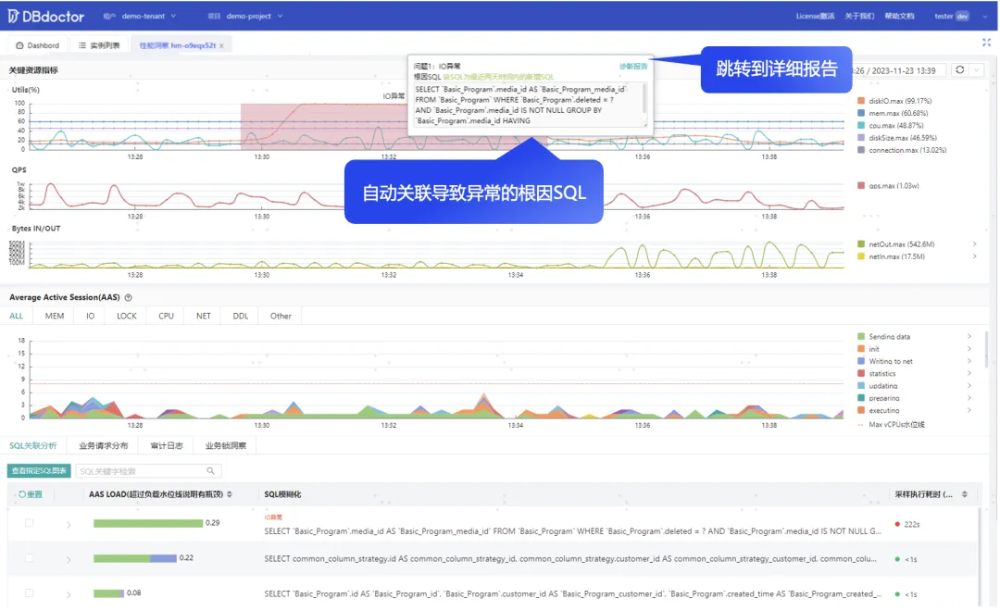

Automatically analyze and derive root cause SQL

The root cause diagnosis page in the following figure directly provides the source SQL of the problem from the perspective of the results. Each SQL will describe the problem phenomenon in detail, count the frequency of the problem occurrence, and list the abnormal events caused by this SQL.

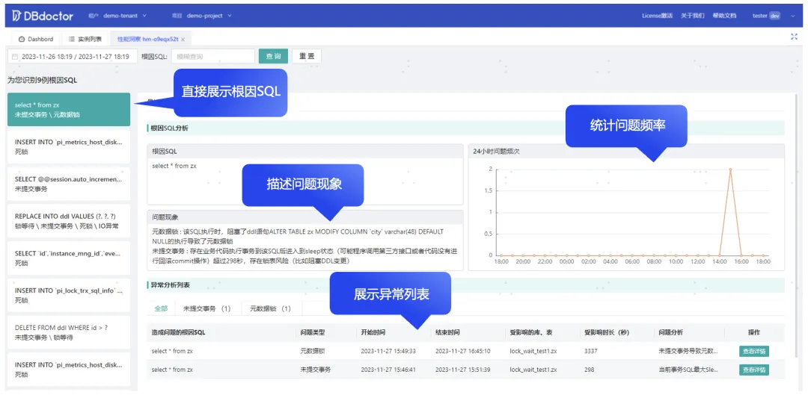

Root cause diagnosis report

In the era of Cloud Native, DBdoctor also supports multi-tenant management of instances, providing a self-editable performance overview from the tenant perspective. The performance of all instances can be viewed in two dimensions: the number of root cause issues and the number of abnormal events. You can directly click on the problem instance to drill down to the root cause diagnosis page to view the problem details.

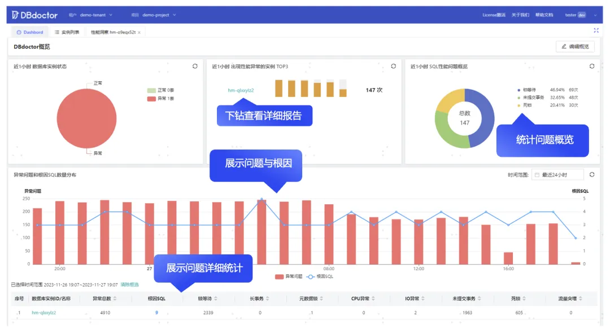

Performance Disc

## 04.Application scenarios

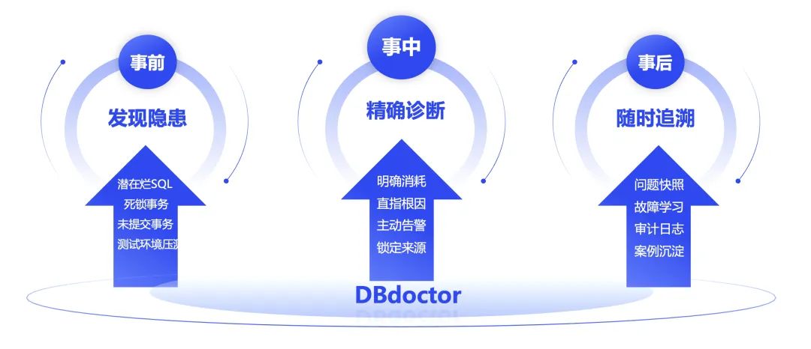

Finally, let's talk about application scenarios.

1. **Take the initiative to find hidden dangers and avoid failures in advance**.The Yellow Emperor's Inner Canon says that the sage does not cure the disease before it occurs, and does not cure the chaos before it occurs. The same is true for databases. I have contacted a customer who has not experienced performance failures in the company's database for three years. However, when using DBdoctor to access the first instance, I found a DDL lock problem caused by an uncommitted transaction. In the past, R & D also feedback that occasional DDL changes would get stuck, but I just did not know which SQL blocked it. Later, I connected most of the instances and finally found 35 potential problems. Although these problems have not failed now, they may explode one day. In addition, some newly developed systems or systems replaced by database engines can be connected to DBdoctor during torture testing to expose problems as much as possible in the testing environment. We are currently breaking through the SQL performance evaluation function. When you are not sure about SQL performance, you can evaluate it in real time on DBdoctor. Interested friends can pay attention to our subsequent versions.

2. **Reduce the threshold of performance diagnosis, so that developers can also diagnose performance problems**.DBdoctor no longer relies on professional experience, nor does it need to scrutinize many and miscellaneous monitoring indicators. Through simple color contrast, it can find the problem SQL, actively select the problem interval, directly point to the root cause of the problem, give solution suggestions, and truly achieve 24-hour guarding of your database like a CT machine. In addition, our pre-research team has run through all scenarios of SQL index recommendation, collected key indicators of SQL optimizer through eBPF, and can build an index tree based on online data to accurately recommend indexes. This function will soon be available to everyone.

3. **Emergency firefighting, quickly locate the root cause, reduce business losses**.  Based on the kernel's finer grain index collection, mathematical quantitative analysis is carried out through Big data to quickly and accurately diagnose the root cause of performance, actively issue abnormal events carrying root cause SQL, and facilitate everyone to access the email group and operation and maintenance group. For example, if an online DDL change is blocked and the DDL acquires the MDL lock, it will further block all additions, deletions, modifications, and queries to this table, seriously affecting the business. If the MDL-related instrument is not enabled, it is quite tricky to find out who blocked the DDL, unless all the sessions before the DDL are found. In this scenario, everyone's first thought to put out the fire is to quickly kill the DDL statement. However, if the DDL is blocked before the commit, killing the DDL will roll back the previous operation, which is still very costly. Using DBdoctor will directly tell you who is to blame for this problem. Root cause diagnosis will put the blocking DDL statement in the exception event, and you can also find the transaction details of this SQL in uncommitted or long transactions. This is just an example, and we did not handle it separately because it can never be processed through rule processing.

**In the future, solving all performance problems of the database and achieving high autonomy is DBdoctor's vision. Accurate diagnosis covering all aspects is a solid foundation, completing decision-making recommendations is advanced, and truly implementing high autonomy is our ultimate goal.**

